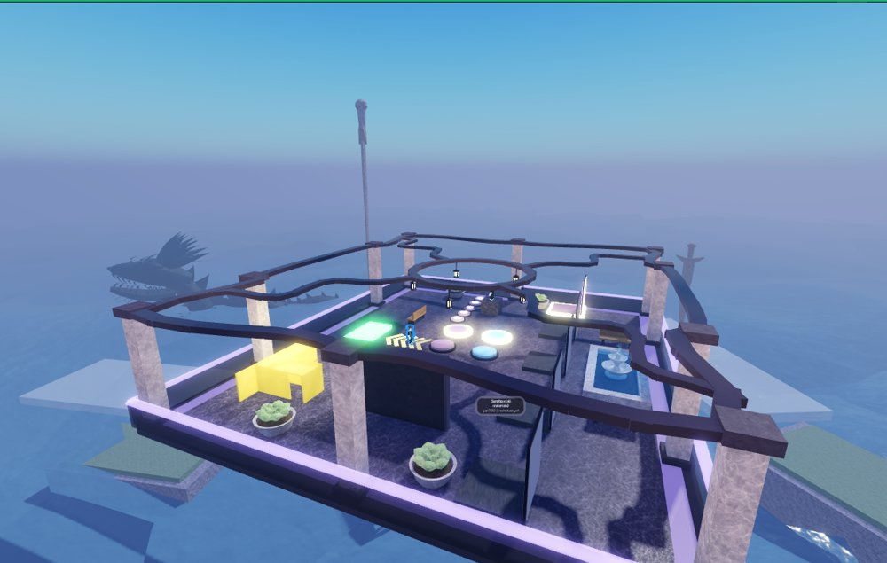
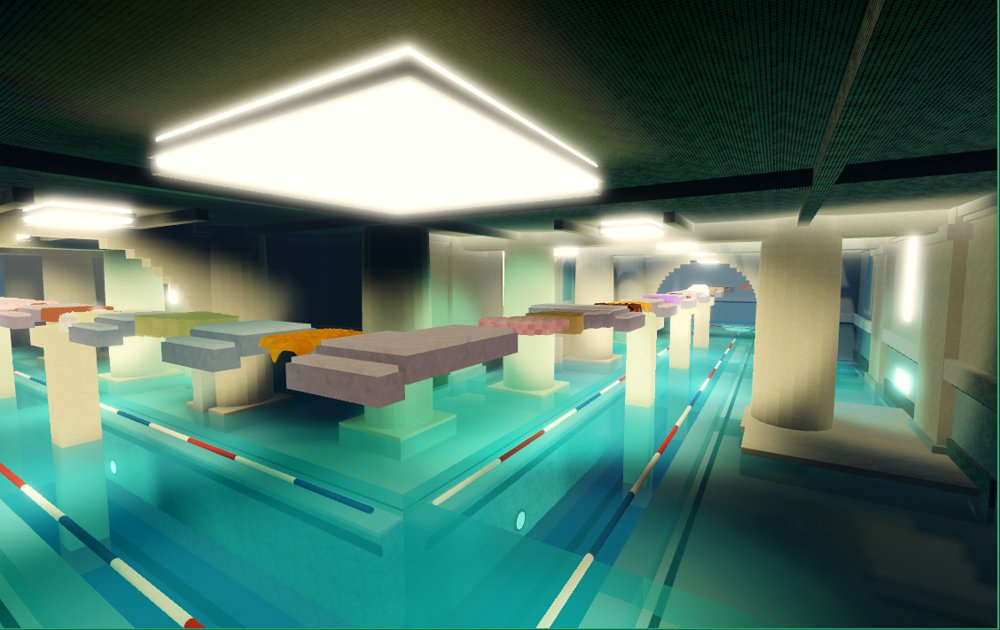
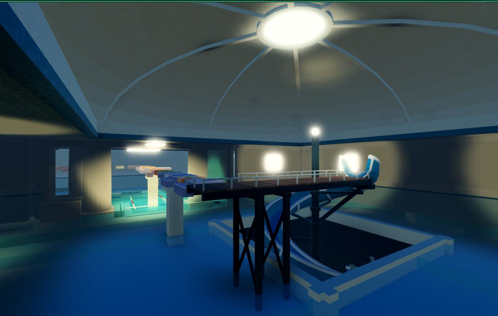
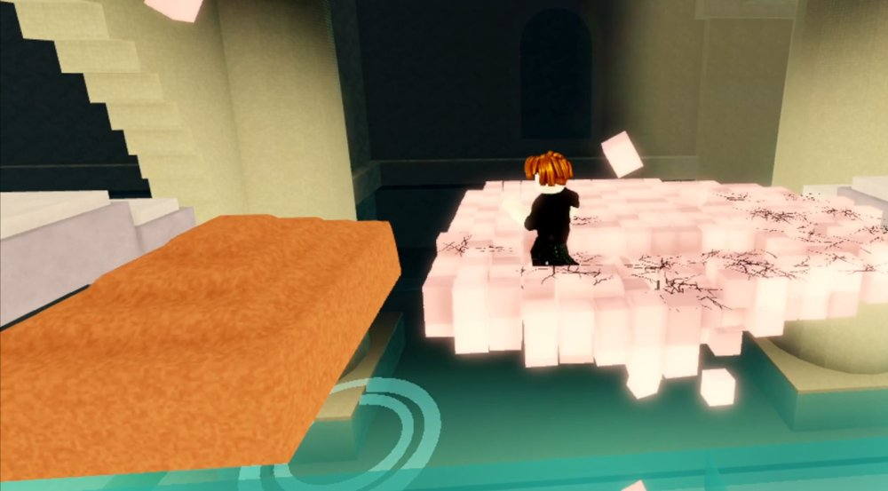
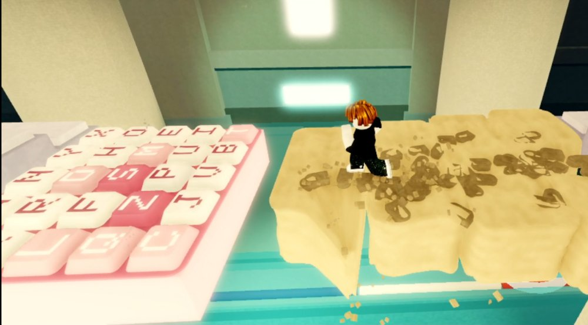
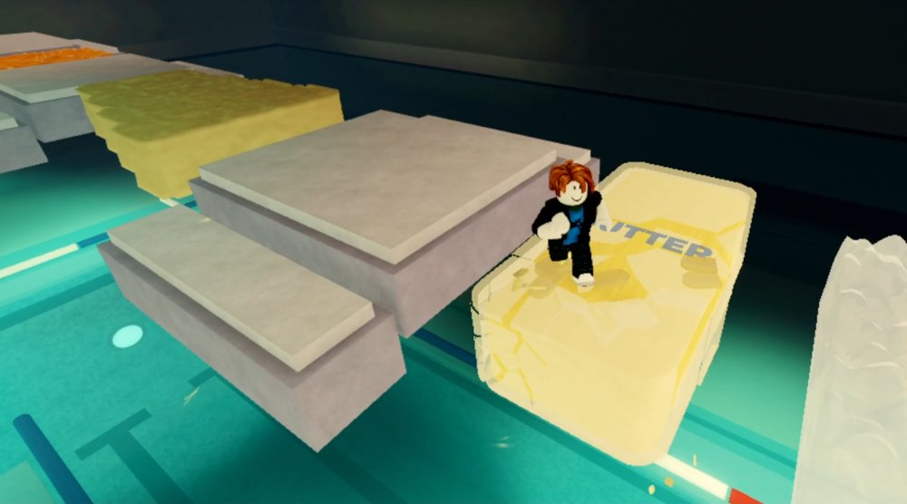

# ASMR Platformer (Roblox)

A 3D platformer where every platform is a different tactile material. Each one reacts
to the player in its own way: honey dents and slowly recovers, soap crumbles under your
feet, wax cracks and lets you sink into the butter underneath, bubble wrap pops.

**Status:** in development, not yet published. 26 materials across 65 chunk templates
and 4 levels, chosen from a lobby. Sound is in for 7 materials; the rest are still silent.

## Screenshots

| | |
|---|---|
|  |  |
| **The lobby**, where players vote on level, mode and run length | **The Flooded Halls**, a bathhouse level built along the platform route |
|  |  |
| **The final chamber**, where the run ends on a water slide | **Soap** breaking into cubes under the player |
|  |  |
| **Kinetic sand** holding footprints and shedding clumps | **Butter-wax** coating cracking into shards |

## What's built

The six original materials, and how each one works:

| Material | How it works |
|---|---|
| Honey | Rigged mesh with one bone per cell; footsteps push dents that recover over time |
| Slime | Rigged mesh with springy bone waves that snap back |
| Soap | Built from small cubes that break off one by one as physics debris, dropping you through |
| Butter-wax | Butter block under a wax coating split into Voronoi shards; shards push apart where you stand |
| Kinetic sand | Rig presses a bowl, a stamped sole sits inside it; cells collapse after 3 footsteps |
| Bubble wrap | One bone per pocket; pockets under your foot pop flat |

Other systems:

- **Lobby:** one pad per level, plus mode (Chill or Hardcore) and run length pads. Players
  vote to start, and the server builds the run from their choices.
- **Levels:** three spiral levels and the Flooded Halls, a bathhouse level whose corridor walls
  are built along the same route the platforms follow, ending on a water slide.
- **Procedural generation** from chunk templates, server/client split for deformation state,
  a timer, personal bests and a leaderboard.

## Tech

- **Luau** (Roblox) for all gameplay code in `src/`
- **Python + Blender** scripts in `blender/` that generate every rigged mesh, validate
  the geometry before export, and render previews
- **Python checkers** (`check_lua.py`, `check_chunk_forms.py`, `check_hub.py`, `check_halls.py` in `blender/`) that catch
  layout and code bugs without opening Roblox Studio

## Repo layout

```
src/        Luau source (Client, Server, Shared)
blender/    mesh generators, render scripts, checkers
meshes/     exported FBX/OBJ files
textures/   generated PBR texture maps
```

See `DEVELOPMENT.md` for Studio setup and run steps, and `HANDOFF.md` for detailed
design notes on each material.
