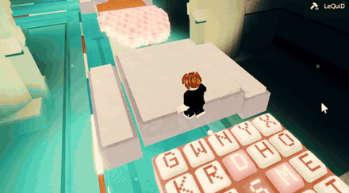
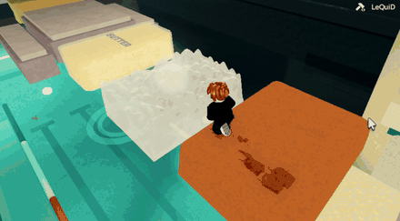
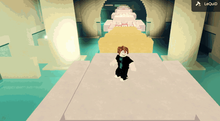
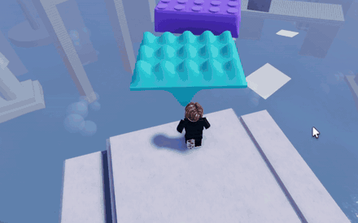
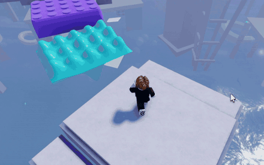
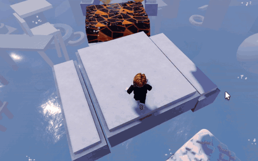
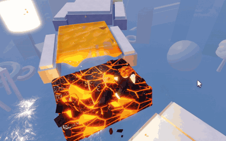
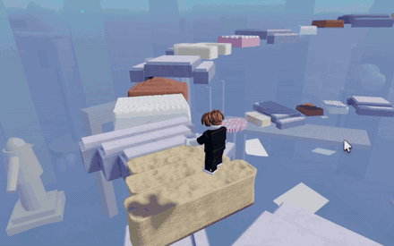

# ASMR Platformer (Roblox)

A 3D platformer where every platform is a different tactile material. Each one reacts
to the player in its own way: honey dents and slowly recovers, soap crumbles under your
feet, wax cracks and lets you sink into the butter underneath, bubble wrap pops.

**Status:** in development, not yet published. 26 materials across 65 chunk templates
and 4 levels, chosen from a lobby. Sound is in for 7 materials, and the keypad has its own synthesized sound set waiting to be uploaded.
See [Status](#status) for what has been tested, what is waiting for a test, and what is not built yet.

## Screenshots

| | |
|---|---|
|  |  |
| **The lobby**, where players vote on level, mode and run length | **The Flooded Halls**, a bathhouse level built along the platform route |
|  |  |
| **The final chamber**, where the run ends on a water slide | **Soap** breaking into cubes under the player |
|  |  |
| **Kinetic sand** holding footprints and shedding clumps | **Butter-wax** coating cracking into shards |

### Materials in motion

| Soap | Butter-wax | Kinetic sand |
|---|---|---|
|  |  |  |
| Cubes break off and fall as debris, opening a hole you drop through | The wax coating cracks into shards and the butter keeps the dent | Footprints stay, and the surface sheds clumps from the rim |

| Jello | Lego | Lava |
|---|---|---|
|  |  |  |
| Wobbles and ripples outward from each step | Studs press down under your feet | Crust cracks open to glowing lava beneath |

| Honey | Memory foam |
|---|---|
|  |  |
| Footprints sink in and slowly flow closed | Presses in and holds the dent |

## What's built

The six original materials, and how each one works:

| Material | How it works |
|---|---|
| Honey | Rigged mesh with one bone per cell; footsteps push dents that recover over time |
| Slime | Rigged mesh with springy bone waves that snap back |
| Soap | Built from small cubes that break off one by one as physics debris, dropping you through |
| Butter-wax | Butter block under a wax coating split into Voronoi shards; shards push apart where you stand |
| Kinetic sand | Rig presses a bowl, a stamped sole sits inside it; cells collapse after 3 footsteps |
| Bubble wrap | One bone per pocket; pockets under your foot pop flat |

Other systems:

- **Lobby:** one pad per level, plus mode (Chill or Hardcore) and run length pads. Players
  vote to start, and the server builds the run from their choices.
- **Levels:** City Shore, a spiral climbing over a pastel beach city; Sky Pools, a meander going down
  past pool terraces to a slide into the clouds; the Flooded Halls, a bathhouse level whose corridor
  walls are built along the same route the platforms follow, ending on a water slide; and the
  Sunken City, a ring just above a drowned city, ending down the harbour drain.
- **Procedural generation** from chunk templates, server/client split for deformation state,
  a timer, personal bests and a leaderboard.
- **Level 1 finale:** the run ends with a high dive off a springboard into the sea, followed by a
  splash, the level's completion banner and a return to the lobby.

## Newer material mechanics

Later materials go beyond denting under your feet. Each one changes how you have to move:

| Material | Mechanic |
|---|---|
| Clay | Each step squeezes clay into the cells around it; an edge lip that takes too much tears off and falls with whoever is on it |
| Salt | Packing a cell pushes brine sideways, cracking, tilting and finally sinking the crust around you |
| Arcade keypads | Three switch types: clicky (cyan) buttons give a speed surge, linear (violet) buttons store charge that the next clicky press releases as a bigger surge, and tactile (pink) buttons raise your jump, higher with each bounce from pink to pink |
| Needoh | Standing still squeezes the bed and charges a jump up to 2.2x normal height |
| Charcoal | Stepping lights a coal; fire spreads to neighbours and burnt coal turns to ash and gives way |
| Oobleck | Players slowly wade in unless they keep moving; a hard landing hardens the whole pool for everyone |

Cracks on soap and charcoal now grow outward from the footstep that caused them, and every
collapse drops the player immediately instead of waiting on the server.

## Status

Last updated: 2026-09-18. `ROADMAP.md` has the detail on everything not built yet.

### Tested in Studio and working

- **City Shore finale (level 1):** the diving board at the top of the spiral and the dive into the
  sea. Landing inside the circle on the water completes the level, with the splash and the fade to
  black.
- **Flooded Halls finale (level 4):** the water slide down into the shaft that ends the level.

### Built, waiting for a test in Studio

Added on 2026-09-18.

- **Level 3 is the Sunken City.** The route circles a drowned city just above the water:
  - Flooded flats you look down into, towers breaking the surface in the haze, a car park with its
    cars just under the water, and a stopped clock tower.
  - Something enormous swims under the route and never chases you. As it passes, the sound drops
    away and the water darkens.
  - Off one checkpoint, a stair tower leads down to a glass aquarium tunnel and a gallery with a
    window you are asked not to tap on.
  - The route ends on a pier over a whirlpool that pulls you down the harbour drain.
  - `blender/plan_sunkencity.py` draws it and `blender/check_sunkencity.py` checks it.
- **Sky Pools, second pass:** the waterfalls are heard, the pools splash and ripple when you walk
  through them, toys drift in them, and there is a pump room behind a hatch under one terrace.
- **Sky Pools, third pass:** a changing cabana with a running shower and a lost-property locker,
  a lifeguard's chair to climb, hot air balloons drifting round the level, and gulls round the
  tower.
- **The chunks lost their dry lanes.** The stable and honey chunks used to carry a ledge each side;
  it let you walk past the honey and caught you when you stepped off the Needoh field. Gone.
- **The Sunken City, ninth pass:** the thing under the route is a sea serpent mesh that bends along
  its whole length; three bugs fixed (the mesh thing never moving, a bone turning right round
  rolling over, jellyfish tentacles stretched into the sea); and the client does much less every
  frame.
- **The Sunken City, eighth pass:** the animals, fish, gulls and kelp as rigged meshes that swim
  by bending (the part-built ones stay as the fallback); kelp canopies streaming down the street; a
  drowned Ferris wheel turning off the street with one cabin still lit; and jellyfish, a new
  material you bounce across, in two new chunks. Fixes the build crash from the seventh pass.
- **The Sunken City, seventh pass:** no more flickering roofs at the waterline; the street's buildings
  stand; facades all the way down; life-size vehicles, a tram, street furniture and a reef on the
  road; dolphins leaping, turtles surfacing, jellyfish, coloured shoals and gulls where you can see
  them; the flat's flooded floor to swim down into; a whirlpool that flows; and the lobby countdown
  ticking on the second.
- **The Sunken City, sixth pass:** ice no longer vanishes over the water; the aquarium's stair ends
  beside the tunnel instead of across it; its glass lets the water show, cracks when tapped and
  breaks, flooding the aquarium and washing you out; kelp that sways, coral, a diver's helmet, animals
  over the tunnel and something that looks in at the window; animals, shoals, kelp and flotsam in the
  street where you can see them.
- **The Sunken City, fifth pass:** the empty frames standing in the sky were facades drawn ninety
  studs above their buildings, now fixed; the odd square of water by the aquarium is gone; every
  block has a roof; real lanterns, skyscraper tops and a clock tower with a bell that tolls on its
  own; rippling water; rays, turtles, jellyfish, eels and groupers swimming the street; rain showers,
  lit windows that should not be, strange sounds, and something enormous surfacing on the horizon.
- **The Sunken City, fourth pass:** buildings with storeys, sills and windows set into the wall,
  rust and fallen render, weed at the waterline and ivy up the walls, and the sandbags, scaffolding,
  pumps and floodlights of a city that was fighting the water and has not quite stopped.
- **Every level ends in its own language:** the completion banner takes the level's gradient and
  draws a motif inside it -- a sun setting, cloud, caustics, tile -- with one thing moving.
- **The Sunken City, third pass:** the route runs down the drowned boulevard instead of round the
  city, the blocks stand either side of it with their frontages on the kerb, shoals of fish swim in
  the water and something long turns in the haze at the back of it, the aquarium's glass can be
  tapped and answers, and the drain ends in a sluice chamber rather than a black shaft.
- **The Flooded Halls, fixed:** the flume no longer teleports you onto a platform part way down,
  and the halls' own weather and rooms no longer follow you back to the lobby.
- **Sky Pools, fourth pass:** the route follows a meander down instead of going round a ring, the
  terraces take alternating sides of it and are no longer squares, the pools are terrain water you
  really swim in with steps to walk in down, and the slide is a sled you sit in and your own client
  draws, so it no longer stutters.
- **The Sunken City, second pass:**
  - In Hardcore, the thing now surfaces every so often under the route and a surge takes anyone
    standing there back to the start. It gives five seconds of warning, and in Chill it only
    watches.
  - A dry flat off a checkpoint has a stairwell into the flooded floor below and a bathroom mirror
    that, once a server, shows a face (Hardcore only).
  - A lantern marks the end of the pier.
- **Level 2 is Sky Pools.** The route is a meander that goes down, past five pool terraces on
  columns, with loungers, parasols, a ladder and a diving board into one pool. A fountain tower
  stands in the middle of the ring and a flat cloud sea lies below. At the end you hold E on the
  finale deck and a slide carries you round the tower and down through the clouds into the final
  pool; the splash ends the level. It has its own late-morning light and finale banner.
  `blender/plan_skypools.py` draws it, and `blender/check_skypools.py` checks it on short, medium
  and long runs.
- **City Shore, rebuilt as a pastel beach city.** A crescent of land round a bay, placed with its
  back to the sun: a beach, a promenade of palms and a row of deco hotels facing the water, towers
  rising behind them (one in three glass), and harbour walls where the crescent ends. The open sea
  toward the sun holds the sandbars and the giant objects, and the aquapark stands in the bay. The
  white eggs, the ball clouds, the placeholder shapes and the ring of columns are gone, and the pink
  fog is replaced by clear golden air. `blender/plan_cityshore.py` draws it from above.

Added on 2026-09-17.

- **Chunks repair themselves.** Every hole a player opens fills back in within 30 seconds, and no
  surface holds its dents for longer either. A clay lip that tore off where you needed the jump
  used to be gone for the rest of the run, and the only way past it was to restart the level.
- **The dive no longer cuts to black,** and the completion banner is the ending instead: the
  level's name and colour, a line about what you just did, and the run's time under a rule that
  draws itself in. The screen darkens a little at the top and bottom rather than going black, so
  the dive stays on screen.
- **City Shore has its own light:** late afternoon over the water, with the sun low and large
  enough to be in the picture as you dive into it, and less haze than the level inherited from
  the lobby. The lobby gets its own air back when the last player leaves a run.

The rest of this list went in earlier the same day. The client renderer failed to load right after
those went in (Luau's limit of 200 locals in one function, fixed since), so none of them has been
seen in game yet.

- **Keypads:** violet buttons store a charge that the next cyan press releases as a bigger speed
  boost; pink buttons raise your jump, higher with each bounce from pink to pink; pink no longer
  slows you down.
- **Cracks that grow** out from your foot on soap and charcoal, instead of appearing all at once.
- **Oobleck without cracks.**
- **Clay's edge tearing off as one slab** again, back from the sagging version.
- **The renderer loading again.** Every material's visuals depend on it.

### Not built yet

Game features:

- **Story mode:** the levels played in order, starting with City Shore's dive leading into the
  Flooded Halls.
- **The Backrooms:** a secret level you fall into after too many falls in one run.
- **Scares and secrets:** an eerie atmosphere, a monster that sends you back to spawn in Hardcore,
  a rare scary face in a mirror, and small places to explore off the route at checkpoints.
- **More worlds:** a kids' playground, office floors, a parking lot, a museum, an aquarium, a tiny
  world of bugs, and more.

Content and setup:

- **Sound for 15 materials:** ice, jello soda, lamb's ear, foam, light switch, lego, charcoal,
  chocolate, clay, cloud, salt, lava, oobleck, snow and Needoh are silent. `SOUND_BRIEF.md` says
  what each one needs.
- **The keypad's sounds** are made (`audio/buttons/`) but not uploaded, so it plays the keyboard's
  sound until they are.
- **Texture maps on the Buttons and ButterStick meshes:** each still needs a SurfaceAppearance
  added in Studio.
- **Soap giving way across the whole platform**, not only in the cells you stand on.
- **A shared module for remote events**, so services stop depending on the order scripts start in.

## Tech

- **Luau** (Roblox) for all gameplay code in `src/`
- **Python + Blender** scripts in `blender/` that generate every rigged mesh, validate
  the geometry before export, and render previews
- **Python checkers** in `blender/` (`check_lua.py`, `check_chunk_forms.py`, `check_plan_shapes.py`,
  `check_hub.py`, `check_halls.py`, `check_skypools.py`, `check_sunkencity.py`) that catch layout and code bugs without opening Roblox Studio.
  `check_lua.py` counts the locals live at once in every function the way Luau's compiler does, so
  a module that would fail to load with "Out of local registers" fails the check first
- **Python + NumPy/SciPy** in `audio/gen_button_sfx.py`, which synthesizes the keypad's sound
  effects instead of using stock audio

## Repo layout

```
src/        Luau source (Client, Server, Shared)
blender/    mesh generators, render scripts, checkers
meshes/     exported FBX/OBJ files
textures/   generated PBR texture maps
audio/      sound effect generator and its WAV output
```

See `DEVELOPMENT.md` for Studio setup and run steps, and `HANDOFF.md` for detailed
design notes on each material.
