# ASMR Platformer (Roblox)

A 3D platformer where every platform is a different tactile material. Each one reacts
to the player in its own way: honey dents and slowly recovers, soap crumbles under your
feet, wax cracks and lets you sink into the butter underneath, bubble wrap pops, lava
bubbles and spits before it bursts.

Under the platforming there is a story. Every level is Harrow Bay on 14 August, the day the
sea came in, a little later each time, and the pumping station's key holder never came to work.
The people there live it as an ordinary day. At the end the time card on the wall has your name
on it.

**Status:** in development, not yet published. 27 materials across 67 chunk templates, 4 levels
and a Sandbox chosen from a lobby, 11 people with lines, 27 keepsakes, 5 secrets, and an ending
for every level shot as a scene with its own sounds. Every material has a sound (generated
stand-ins where there is no recording yet). See [Status](#status) for what has been tested, what
is waiting for a test, and what is not built yet.

## Screenshots

| | |
|---|---|
| 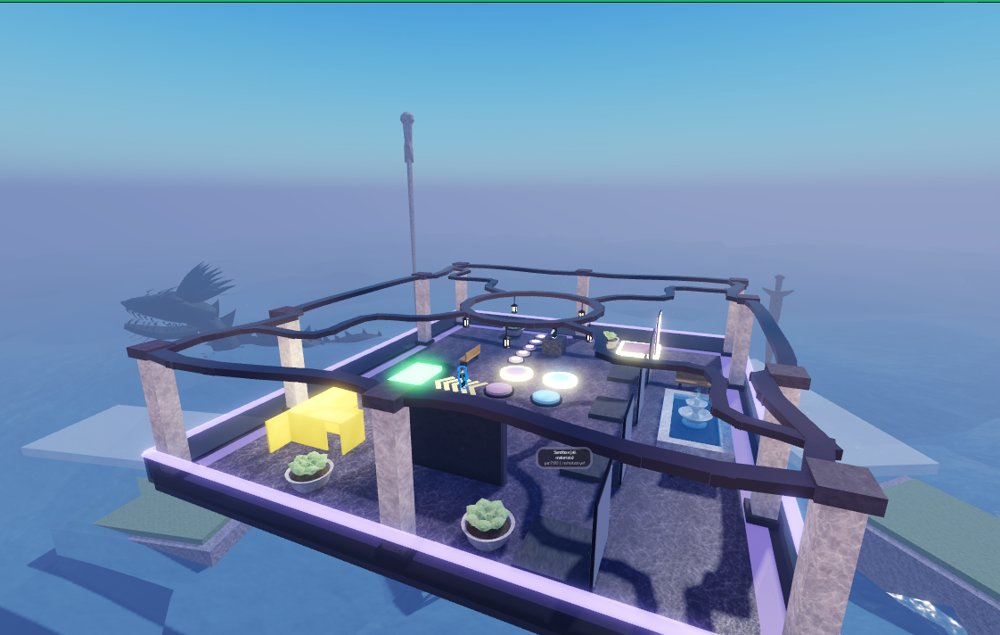 | 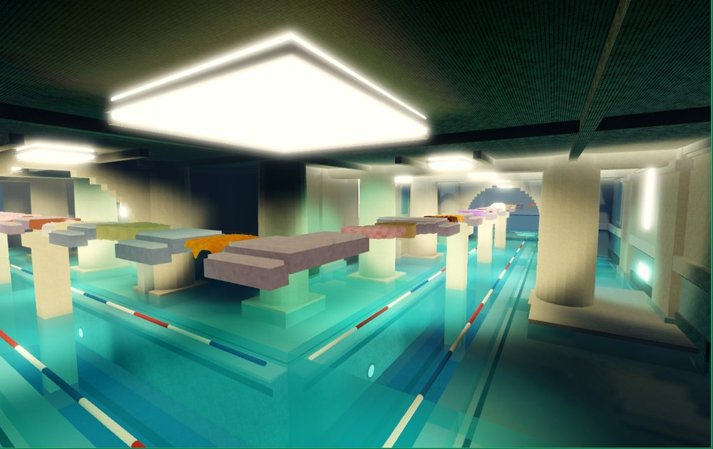 |
| **The lobby**, where players vote on level, mode and run length | **The Flooded Halls**, a bathhouse level built along the platform route |
| 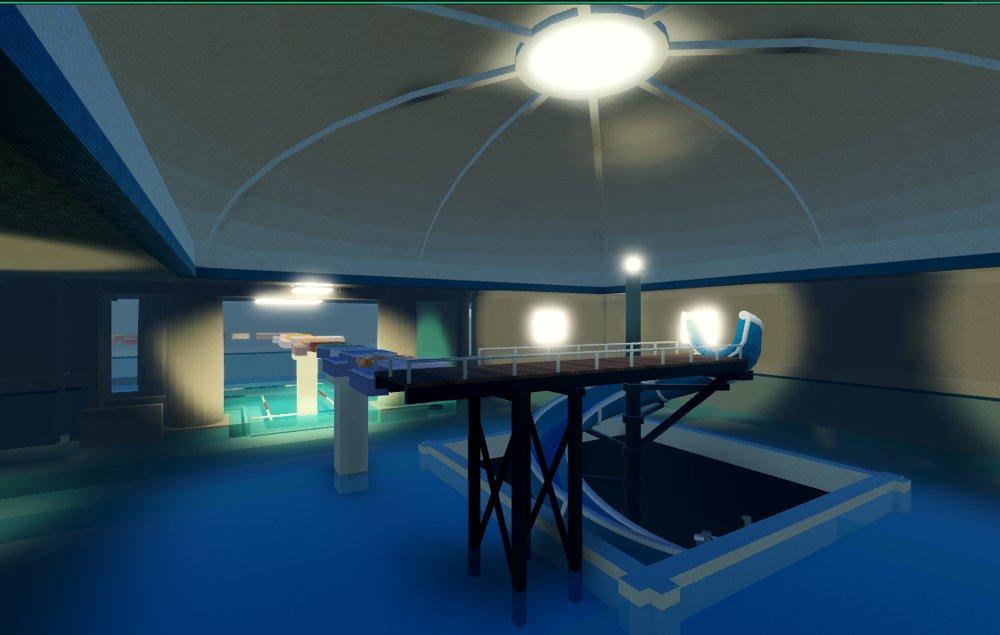 | 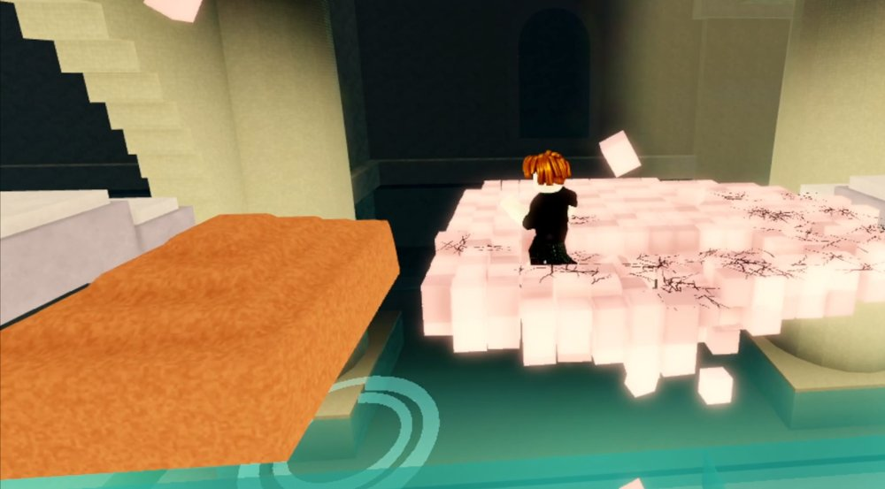 |
| **The final chamber**, where the run ends on a water slide | **Soap** breaking into cubes under the player |
| 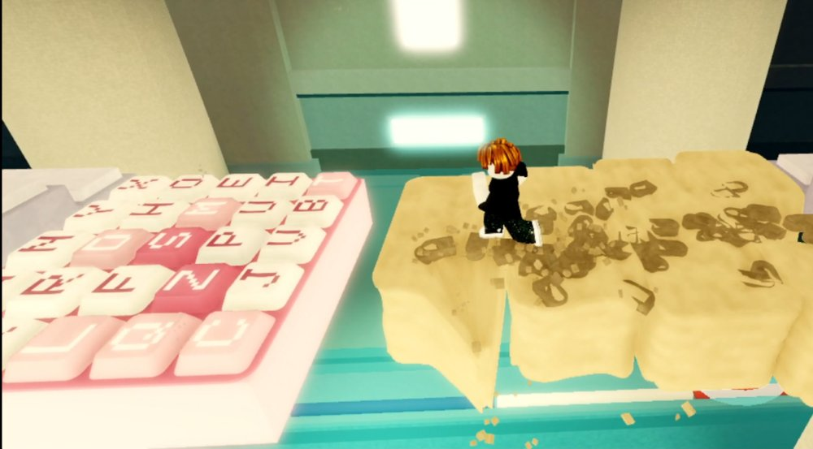 | 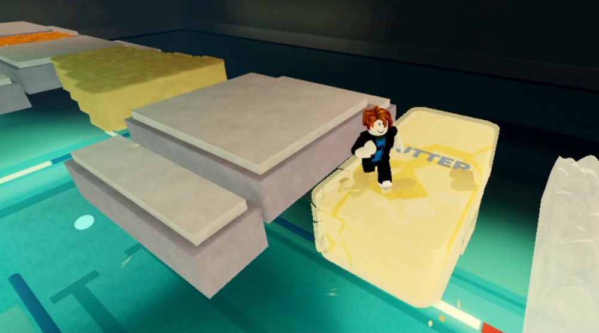 |
| **Kinetic sand** holding footprints and shedding clumps | **Butter-wax** coating cracking into shards |

### Materials in motion

| Soap | Butter-wax | Kinetic sand |
|---|---|---|
| 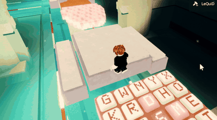 | 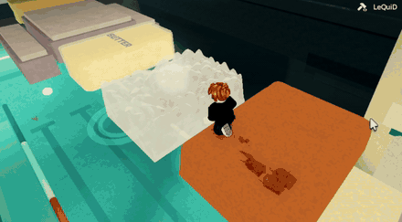 | 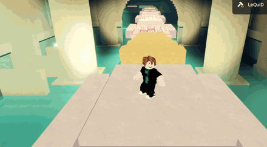 |
| Cubes break off and fall as debris, opening a hole you drop through | The wax coating cracks into shards and the butter keeps the dent | Footprints stay, and the surface sheds clumps from the rim |

| Jello | Lego | Lava |
|---|---|---|
| 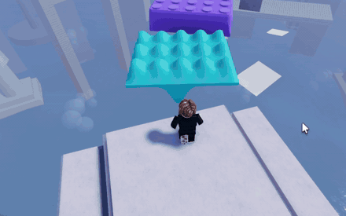 | 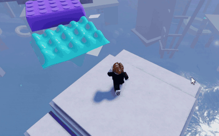 | 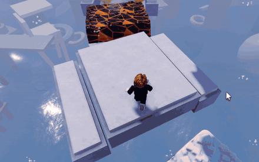 |
| Wobbles and ripples outward from each step | Studs press down under your feet | Crust cracks open to glowing lava beneath (the screenshot is from before the embers and bubbles) |

| Honey | Memory foam |
|---|---|
| 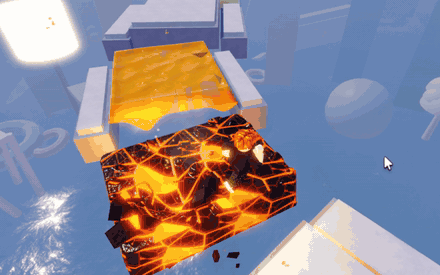 | 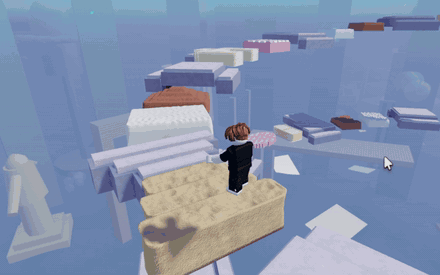 |
| Footprints sink in and slowly flow closed | Presses in and holds the dent |

## The game as it stands

### The lobby

A permanent room that runs are built and torn down around. One pad per level, each made
of that level's headline material, plus a Sandbox pad with every material; a mode pad (Chill or
Hardcore) and a run-length pad (Short, Medium, Long); a personal-best statue and a leaderboard.
Players vote to start and the server builds the run from their choices. A coin-op telescope on the
terrace is the only way into first person: "Look through" and you are in first person from then
on, "Step back" and you are back in a proper third person view.

### The levels

They are numbered in the order they happen on 14 August.

| # | Level | When | The route | The ending |
|---|---|---|---|---|
| 1 | City Shore | 9:14 in the morning | a spiral climbing over a pastel beach city round a bay, the Siren Tower in the middle | a high dive off a springboard into the sea: a cut back to Maren watching, a flock of gulls you fall through, and under the water a drowned street with one lamp still on |
| 2 | Sky Pools | three in the afternoon | a meander going down past pool terraces over a drifting cloud sea, round a fountain tower | a sled down the slide, through the clouds, skipping across the final pool |
| 3 | The Sunken City | eight minutes to midnight | a ring just above a drowned city, with something enormous under it, an aquarium and a dry flat off the checkpoints | a whirlpool at the end of the pier pulls you down the harbour drain and along Outfall 3 to the pumping station, where the time card has your name |
| 4 | Flooded Halls | four minutes to midnight | the Corporation Baths, their tiled corridors built along the platform route | a flume into the dark, a mouth at the bottom of the fall, then the Gate Chamber, where you open Outfall 3 with the key that was in your pocket all along |

Every level has its own light, its own ambience bed, its own completion banner drawn in its own
motif, and six seconds to look round after LEVEL COMPLETE before the lobby.

### The story

- **People** (Sal, Pip and Maren at City Shore; Dev, Mrs Okafor and Rudy at the Sky Pools; the
  attendant and the fisherman in the Sunken City; Mrs Venn, Tobi Okafor and Mr Barlow in the baths)
  greet you, follow you with their eyes, have habits of their own and talk when you press F.
- **The journal** (J): the letters, notes and keepsakes you pick up, to read when you choose.
  Nothing comes up over the level.
- **Keepsakes**: every material is something someone in Harrow Bay was holding when the water came
  (27 of them), picked up as toys from lit nooks off the route.
- **Secrets**: five across the levels, opened with Mr Barlow's pry bar or a sharp eye, each found as
  a short scene (City Shore's is the Siren Tower in the middle of the spiral).
- `LORE.md` is the canon; `story/HARROW_BAY.fountain` is the story as a screenplay.

### The endings

Each ending is a scene with its own camera, letterbox bars and captions held until you have read
them; the level's own sound falls silent and the scene is scored with sounds of its own (the board
letting you go, the wind all the way down, the splash, the hum under the harbour, a last chord).
The banner and the lobby wait for the scene to finish.

### Controls

| Key | What it does |
|---|---|
| WASD, Space | move and jump; standing still on the Needoh charges a bigger jump |
| Ctrl | lock the cursor in the middle (the camera turns with the mouse, you face where you look), and free it again |
| E | the prompts: take, look, tap, slide, ride, sit |
| F | talk to someone |
| J | the journal |
| Esc or M | the pause menu |
| F7 | hide or show the Sunken City's Studio panel (in Studio only) |

## The materials

The six original materials, and how each one works:

| Material | How it works |
|---|---|
| Honey | Rigged mesh with one bone per cell; footsteps push dents that recover over time |
| Slime | Rigged mesh with springy bone waves that snap back, and a launch with a camera kick |
| Soap | Built from small cubes that break off one by one as physics debris, dropping you through |
| Butter-wax | Butter block under a wax coating split into Voronoi shards; shards push apart where you stand |
| Kinetic sand | Rig presses a bowl, a stamped sole sits inside it; cells collapse after 3 footsteps |
| Bubble wrap | One bone per pocket; pockets under your foot pop flat, heard the moment you step |

Later materials go beyond denting under your feet. Each one changes how you have to move:

| Material | Mechanic |
|---|---|
| Clay | Each step squeezes clay into the cells around it; an edge lip that takes too much tears off and falls with whoever is on it |
| Salt | Packing a cell pushes brine sideways, cracking, tilting and finally sinking the crust around you |
| Arcade keypads | Three switch types: clicky (cyan) buttons give a speed surge, linear (violet) buttons store charge that the next clicky press releases as a bigger surge, and tactile (pink) buttons raise your jump, higher with each bounce from pink to pink |
| Needoh | Standing still squeezes the bed and charges a jump up to 2.2x normal height; it has its own gloopy squish, not clay's |
| Charcoal | Stepping lights a coal; fire spreads to neighbours and burnt coal turns to ash and gives way |
| Oobleck | Players slowly wade in unless they keep moving; a hard landing hardens the whole pool for everyone |
| Lava | A crust over glowing lava that breathes light, throws off embers and heat haze, and bubbles and spits; it spurts where you stand and erupts in a fountain when a cell bursts |
| Jellyfish | A glowing bell you bounce across (the Sunken City's own chunks) |

The rest: ice, jello soda, lamb's ear, foam, light switches, lego, chocolate (soft
and solid), cloud, snow, a creamy keyboard, lava keys and a butter stick. Cracks on soap and
charcoal grow outward from the footstep that caused them, every collapse drops the player at once,
and every hole fills itself back in within 30 seconds.

## Status

Last updated: 2026-09-30. `ROADMAP.md` has the detail on everything not built yet, and `HANDOFF.md`
on everything built, pass by pass.

### Tested in Studio and working

- **City Shore finale (level 1):** the diving board at the top of the spiral and the dive into the
  sea. Landing inside the circle on the water completes the level, with the splash and the fade to
  black.
- **Flooded Halls finale (level 4):** the water slide down into the shaft that ends the level.

### Built, waiting for a test in Studio

Added on 2026-09-18.

- **Level 3 is the Sunken City.** The route circles a drowned city just above the water:
  - Flooded flats you look down into, towers breaking the surface in the haze, a car park with its
    cars just under the water, and a stopped clock tower.
  - Something enormous swims under the route and never chases you. As it passes, the sound drops
    away and the water darkens.
  - Off one checkpoint, a stair tower leads down to a glass aquarium tunnel and a gallery with a
    window you are asked not to tap on.
  - The route ends on a pier over a whirlpool that pulls you down the harbour drain.
  - `blender/plan_sunkencity.py` draws it and `blender/check_sunkencity.py` checks it.
- **Sky Pools, second pass:** the waterfalls are heard, the pools splash and ripple when you walk
  through them, toys drift in them, and there is a pump room behind a hatch under one terrace.
- **Sky Pools, third pass:** a changing cabana with a running shower and a lost-property locker,
  a lifeguard's chair to climb, hot air balloons drifting round the level, and gulls round the
  tower.
- **The chunks lost their dry lanes.** The stable and honey chunks used to carry a ledge each side;
  it let you walk past the honey and caught you when you stepped off the Needoh field. Gone.
- **Twenty-first pass:** every ending scored with sounds of its own (17 made in `audio/endings/`);
  the Needoh with a sound of its own instead of clay's; lava that glows, breathes, throws off embers
  and heat, bubbles and spits, and erupts when it bursts; and the high dive shot properly, with a cut
  back to Maren, gulls to fall through, the air rushing past, the sun flaring, and light and fish
  under the water.
- **Twentieth pass:** Roblox's own prompts again (the restyled ones pinned the cursor near NPCs); back
  from first person straight into a proper third person view; your voice in the drain lettered like a
  voice and slow enough to read; one text size in every speech bubble; the Sky Pools without the milky
  haze, its slide clear of the rider, and its people each with a habit.
- **Nineteenth pass:** third person is the game's view; first person only through a seaside viewer in
  the lobby, nothing on the screen for it; Ctrl locks and frees the cursor; a camera kick on slime launches; the Sky Pools' cloud sea drifts and lifts.
- **Eighteenth pass:** a journal (J) keeps what you pick up to read when you choose, and nothing comes
  up over the level; keepsakes are toys you pick up, and they, the notes and the pry bar sit in lit
  nooks off the route, which the level sometimes leads you to; captions held until read, and the lobby and banner wait for an ending to finish;
  every ending redone (the dive, the Sky Pools' skim and fountain tower, the Sunken City's swirling
  whirlpool and lined shaft, the smooth flume and the maw with nothing covering it); a safe Siren Tower
  bridge, calmer fish, bubble wrap heard at once, soap without cracks, softer Sky Pools light.
- **Seventeenth pass:** endings silence the level's own sound; every level has an ambience bed and the
  Hold's drone under it; the story is written as a screenplay (`story/HARROW_BAY.fountain`); every
  level has letters on the ground, Mr Barlow's pry bar, and a secret it opens, each found as a short
  scene (City Shore's is the Siren Tower in the middle of the spiral); and the Flooded Halls' flume ends
  in a giant mouth in the dark, only its teeth ever seen, before the Gate Chamber.
- **Sixteenth pass, the Hold:** the story's own idea (`LORE.md`): every material is a keepsake,
  something someone in Harrow Bay was holding when the water came. Step on one for the first time and
  a card says whose it was ("Keepsake 5 of 27"). A fourth thing to read on every level, and the Hold,
  the Watcher and the key holders before you in what people say.
- **Fifteenth pass:** every ending plays at about half speed with captions held long enough to read,
  your character always in shot whatever your camera zoom; the Flooded Halls end in the Gate Chamber
  under the waterworks, where you open Outfall 3 with the key that was in your pocket all along; the
  baths have their own people (Mrs Venn, Tobi Okafor, Mr Barlow); every level has three things to read
  (press R); everyone is dressed properly and talks with their hands, and what they say stays up twice
  as long; the levels are numbered in the order they happen on 14 August; F7 hides the Studio panel;
  and every material that had no sound has four generated takes (`audio/gen_material_sfx.py`).
- **A story across the levels, fourteenth pass:** Harrow Bay on 14 August, the day the sea came in
  and the pumping station's key holder never came to work. Each level opens on the same day, later
  each time, and has people living it as an ordinary day who greet you, follow you with their eyes and
  talk when you press F: Sal, Pip and Maren at City Shore; Dev, Mrs Okafor and Rudy at the Sky Pools;
  the attendant and the fisherman in the Sunken City. At the end, the time card has your name on it.
- **Endings as scenes, fourteenth pass:** City Shore's dive is shot as a scene, head first, ending
  under the water over a drowned street with one lamp still on; the Sky Pools' slide is shot as a
  scene with the rider's arms up; the Sunken City's drain goes on down Outfall 3 to the harbour
  pumping station. Every level now leaves you six seconds after LEVEL COMPLETE before the lobby. The
  Sunken City's fish come in bigger shoals and dart out of your way.
- **The Sunken City, thirteenth pass:** the client Bootstrap in the place was an old copy that never
  started this level's client (paste the current one); joints of the newer avatar kind are turned, so
  the rider flails and the fisherman sits; the drain is a grab, a spin, a tumble and a landing with
  its own camera shots; the attendant flees, swims and comes back when the glass goes.
- **The Sunken City, twelfth pass:** the aquarium floods with water you can swim in, with a torrent,
  foam, bubbles and floating leaflets; the drain ride flails even when the client is not running; in
  Studio the server says exactly why the client is not running. Sky Pools' water and the soda chunk
  no longer hide or vanish. The hub statue has no score sign.
- **The Sunken City, eleventh pass:** the drain is a little scene with its own camera, you flailing
  and shouting for help; when the glass breaks the sea pours in and fills the gallery for everyone to
  see; the jellyfish glows violet; a detailed treasure chest; and the client no longer stops dead when
  SeaRig is missing, with a Studio panel showing what it draws.
- **The Sunken City, tenth pass:** only the signed window can be tapped, and when it breaks the sea
  pours in and the gallery fills; the animals swim beside the route where you can see them; four
  landmark towers on the skyline; poles, wires, boats, street signs, metro totems and roof signs in
  the streets; and people: the aquarium's attendant, a fisherman on the pier, and someone watching.
- **The Sunken City, ninth pass:** the thing under the route is a sea serpent mesh that bends along
  its whole length; three bugs fixed (the mesh thing never moving, a bone turning right round
  rolling over, jellyfish tentacles stretched into the sea); and the client does much less every
  frame.
- **The Sunken City, eighth pass:** the animals, fish, gulls and kelp as rigged meshes that swim
  by bending (the part-built ones stay as the fallback); kelp canopies streaming down the street; a
  drowned Ferris wheel turning off the street with one cabin still lit; and jellyfish, a new
  material you bounce across, in two new chunks. Fixes the build crash from the seventh pass.
- **The Sunken City, seventh pass:** no more flickering roofs at the waterline; the street's buildings
  stand; facades all the way down; life-size vehicles, a tram, street furniture and a reef on the
  road; dolphins leaping, turtles surfacing, jellyfish, coloured shoals and gulls where you can see
  them; the flat's flooded floor to swim down into; a whirlpool that flows; and the lobby countdown
  ticking on the second.
- **The Sunken City, sixth pass:** ice no longer vanishes over the water; the aquarium's stair ends
  beside the tunnel instead of across it; its glass lets the water show, cracks when tapped and
  breaks, flooding the aquarium and washing you out; kelp that sways, coral, a diver's helmet, animals
  over the tunnel and something that looks in at the window; animals, shoals, kelp and flotsam in the
  street where you can see them.
- **The Sunken City, fifth pass:** the empty frames standing in the sky were facades drawn ninety
  studs above their buildings, now fixed; the odd square of water by the aquarium is gone; every
  block has a roof; real lanterns, skyscraper tops and a clock tower with a bell that tolls on its
  own; rippling water; rays, turtles, jellyfish, eels and groupers swimming the street; rain showers,
  lit windows that should not be, strange sounds, and something enormous surfacing on the horizon.
- **The Sunken City, fourth pass:** buildings with storeys, sills and windows set into the wall,
  rust and fallen render, weed at the waterline and ivy up the walls, and the sandbags, scaffolding,
  pumps and floodlights of a city that was fighting the water and has not quite stopped.
- **Every level ends in its own language:** the completion banner takes the level's gradient and
  draws a motif inside it (a sun setting, cloud, caustics, tile) with one thing moving.
- **The Sunken City, third pass:** the route runs down the drowned boulevard instead of round the
  city, the blocks stand either side of it with their frontages on the kerb, shoals of fish swim in
  the water and something long turns in the haze at the back of it, the aquarium's glass can be
  tapped and answers, and the drain ends in a sluice chamber rather than a black shaft.
- **The Flooded Halls, fixed:** the flume no longer teleports you onto a platform part way down,
  and the halls' own weather and rooms no longer follow you back to the lobby.
- **Sky Pools, fourth pass:** the route follows a meander down instead of going round a ring, the
  terraces take alternating sides of it and are no longer squares, the pools are terrain water you
  really swim in with steps to walk in down, and the slide is a sled you sit in and your own client
  draws, so it no longer stutters.
- **The Sunken City, second pass:**
  - In Hardcore, the thing now surfaces every so often under the route and a surge takes anyone
    standing there back to the start. It gives five seconds of warning, and in Chill it only
    watches.
  - A dry flat off a checkpoint has a stairwell into the flooded floor below and a bathroom mirror
    that, once a server, shows a face (Hardcore only).
  - A lantern marks the end of the pier.
- **Level 2 is Sky Pools.** The route is a meander that goes down, past five pool terraces on
  columns, with loungers, parasols, a ladder and a diving board into one pool. A fountain tower
  stands in the middle of the ring and a flat cloud sea lies below. At the end you hold E on the
  finale deck and a slide carries you round the tower and down through the clouds into the final
  pool; the splash ends the level. It has its own late-morning light and finale banner.
  `blender/plan_skypools.py` draws it, and `blender/check_skypools.py` checks it on short, medium
  and long runs.
- **City Shore, rebuilt as a pastel beach city.** A crescent of land round a bay, placed with its
  back to the sun: a beach, a promenade of palms and a row of deco hotels facing the water, towers
  rising behind them (one in three glass), and harbour walls where the crescent ends. The open sea
  toward the sun holds the sandbars and the giant objects, and the aquapark stands in the bay. The
  white eggs, the ball clouds, the placeholder shapes and the ring of columns are gone, and the pink
  fog is replaced by clear golden air. `blender/plan_cityshore.py` draws it from above.

Added on 2026-09-17.

- **Chunks repair themselves.** Every hole a player opens fills back in within 30 seconds, and no
  surface holds its dents for longer either. A clay lip that tore off where you needed the jump
  used to be gone for the rest of the run, and the only way past it was to restart the level.
- **The dive no longer cuts to black,** and the completion banner is the ending instead: the
  level's name and colour, a line about what you just did, and the run's time under a rule that
  draws itself in. The screen darkens a little at the top and bottom rather than going black, so
  the dive stays on screen.
- **City Shore has its own light:** late afternoon over the water, with the sun low and large
  enough to be in the picture as you dive into it, and less haze than the level inherited from
  the lobby. The lobby gets its own air back when the last player leaves a run.

The rest of this list went in earlier the same day. The client renderer failed to load right after
those went in (Luau's limit of 200 locals in one function, fixed since), so none of them has been
seen in game yet.

- **Keypads:** violet buttons store a charge that the next cyan press releases as a bigger speed
  boost; pink buttons raise your jump, higher with each bounce from pink to pink; pink no longer
  slows you down.
- **Cracks that grow** out from your foot on soap and charcoal, instead of appearing all at once.
- **Oobleck without cracks.**
- **Clay's edge tearing off as one slab** again, back from the sagging version.
- **The renderer loading again.** Every material's visuals depend on it.

### Not built yet

Game features:

- **Story mode:** the levels played in order, one after another, 9:14 in the morning to four
  minutes to midnight. A fifth level before them all, Hill House at eight in the morning, is
  suggested in `LORE.md`.
- **The journal kept between sessions,** and the keepsakes on a shelf in the lobby.
- **The Backrooms:** a secret level you fall into after too many falls in one run.
- **More worlds:** a kids' playground, office floors, a parking lot, a museum, a tiny world of
  bugs, and more.

Content and setup:

- **Real recordings** to replace the generated stand-ins for the materials (`SOUND_BRIEF.md` says
  what each one needs) and, if wanted, for the endings.
- **Texture maps on the Buttons and ButterStick meshes:** each still needs a SurfaceAppearance
  added in Studio.
- **Soap giving way across the whole platform**, not only in the cells you stand on.
- **A shared module for remote events**, so services stop depending on the order scripts start in.

## Tech

- **Luau** (Roblox) for all gameplay code in `src/`, pasted into Studio by hand (line 2 of every
  file says where it goes)
- **Python + Blender** scripts in `blender/` that generate every rigged mesh (the materials, the
  sea life, the serpent, the Ferris wheel, the boats, the landmarks, the mouth), validate the
  geometry before export, and render previews
- **Python checkers** in `blender/` (`check_lua.py`, `check_chunk_forms.py`, `check_plan_shapes.py`,
  `check_hub.py`, `check_halls.py`, `check_skypools.py`, `check_sunkencity.py`, `check_story.py`,
  `check_luau_syntax.py`) that catch layout and code bugs without opening Roblox Studio, all run by
  `blender/check_all.py`, with mutation suites in `blender/mutations/` (passes 8 to 21) that prove
  the checkers catch what they claim to, and `tools/paste_list.py` to list what changed since the
  last paste. `check_lua.py` counts the locals live at once in every function the way Luau's
  compiler does, so a module that would fail to load with "Out of local registers" fails the check
  first
- **Python + NumPy/SciPy** in `audio/`, which synthesises the game's sound instead of using stock
  audio: the keypad (`gen_button_sfx.py`), four takes for every material (`gen_material_sfx.py`),
  the endings and the Needoh (`gen_ending_sfx.py`), plus the scenes' and levels' sounds in
  `audio/story/` and `audio/ambience/`

## Repo layout

```
src/        Luau source (Client, Server, Shared)
blender/    mesh generators, render scripts, level plans, checkers and mutation suites
meshes/     exported FBX/OBJ files
textures/   generated PBR texture maps
audio/      sound generators and their WAV output: buttons/, materials/, story/, ambience/, endings/
story/      the story as a screenplay (HARROW_BAY.fountain)
docs/       design specs and plans, and Studio helper scripts
```

See `DEVELOPMENT.md` for Studio setup and run steps, `HANDOFF.md` for detailed design notes on
each material and level, `LORE.md` for the story, `SOUND_BRIEF.md` for the sounds, and `ROADMAP.md`
for what comes next.
